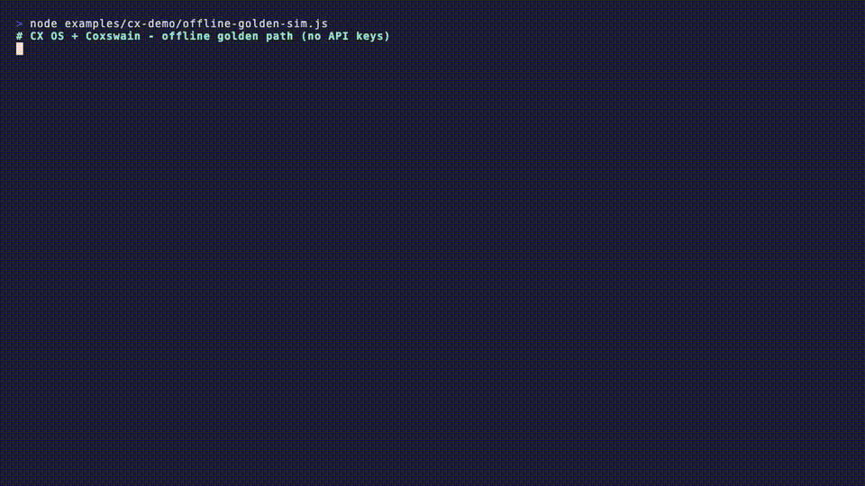

# Coxswain

**Customer Experience Operating System powered by a token-frugal coding agent (Coxswain)**

[](https://github.com/chendren/coxswain/actions/workflows/ci.yml)
[](./LICENSE)
[](https://github.com/chendren/coxswain/releases/latest)
[](./package.json)
[](#4-command-offline-quickstart)

Turn a CX idea into multi-target design artifacts, an offline operate loop, and a plan-only AWS CAB package, without silent production mutation and without a blank-check model bill.

```
idea → pack detect → program → build (artifacts → local → aws plan)
    → health → propose → claim → task → brief / CAB export
```



*Offline demo (no API keys): idea → multi-target healthy program → CAB handoff. [MP4](./examples/cx-demo/offline-golden.mp4) · regenerate with `vhs examples/cx-demo/offline-golden-demo.tape`.*

---

## Five hard rules

| # | Rule | What it means in practice |
|---|---|---|
| 1 | **No silent production mutation** | Console, watch, and daemon **propose only**. Humans claim work into tasks. |
| 2 | **AWS is plan-only** | Coxswain writes `template.yaml` + `APPLY.md`. Humans apply CFN with scoped credentials. |
| 3 | **Never CreateStack from Coxswain** | Product promise, not a temporary limitation. No live CloudFormation mutate from the tool. |
| 4 | **Offline-first** | Golden path, board, brief, and CAB export work without API keys or a live stack. |
| 5 | **Strong graph first** | Ontology packs, NBA match, and console routing are pure graph. Weak models generate only where allowed. |

---

## Who it's for

| Persona | Primary value |
|---|---|
| **CX Product Manager** | Gated programs, shared language, explainable next-best-action |
| **Contact Center / CX Solutions Architect** | Multi-target design + plan-only AWS handoff |
| **Journey Owner / Ops Lead** | Human-gated day-2 proposals and tasks |
| **GenAI / Graph Engineer** | Strong/weak boundary, path audits, pack authoring |
| **Change / Security / Compliance** | No silent prod write; audit trail + APPLY.md + CAB package |
| **AWS PS / Partners** | Offline golden demos + customer-scoped workspaces |
| **Workshop facilitators** | Teachable offline-first graph-node practice |

---

## World (mind → CX app)

A domain expert should never need our vocabulary. Four verbs: **Tell · See · Today · Teach** (Teach is next).

```bash
pnpm cox cx world northwind \
  "National retail: returns and refunds, loyalty, store pickup, order support, retention"
pnpm cox cx app northwind --port 8787
# open http://127.0.0.1:8787/app?spec=northwind
# Today: say what is happening → I'll take this
```

Offline. Closed world. No invented ids. Graph Console stays at `/console` for operators.

## 4-command offline quickstart

Requires **Node ≥ 20** and **pnpm**. No API keys required for this path.

```bash
git clone https://github.com/chendren/coxswain.git && cd coxswain
pnpm install
pnpm cox doctor --offline
pnpm cox --cwd /tmp/cx-demo cx run retail-demo \
  "Customer experience for a national retail brand: returns and refunds, loyalty, store pickup, order support, retention" \
  --target all
pnpm cox --cwd /tmp/cx-demo cx board
pnpm cox --cwd /tmp/cx-demo cx cab-export retail-demo
```

What you should see: multi-target health (artifacts, local, aws plan), a fleet board line, and a CAB package under `./cx-cab/retail-demo/` with `MANIFEST.md`, `BRIEF.md`, plan-only CFN, and remediations.

Domain-agnostic fleet workspace (programs, dashboards, holiday scenarios): **[chendren/CXOS](https://github.com/chendren/CXOS)** with `COXSWAIN_ROOT` pointed at this engine. Telco keyword demo lives in a **separate** workspace (`TelcoCXOS`), not the primary product surface.

---

## What it does for you

| Job | Outcome |
|---|---|
| **Design once** | Idea string → closed-world journeys, personas, intents, KPIs, NBA rules, architecture docs |
| **Build multi-target** | Artifacts → offline local bind → plan-only AWS (`template.yaml` + `APPLY.md`) |
| **Operate day-2** | Health poll → propose → claim/apply → task → done (human-gated) |
| **Fleet view** | Board, queue, HTML dashboard across programs |
| **Govern / CAB** | Brief, audit, snapshot, full CAB export for change boards |
| **Code with receipts** | Spec coding, steering, hooks, three-tier routing, append-only cost ledger |

Vertical packs today: **retail**, **financial**, **healthcare**, **travel** (plus `default` ontology). Registry scores idea text and seeds the matching design pack. Telco is a **separate demo** pack/workspace, not the domain-agnostic primary.

---

## How it works

**Engine × fleet.** Coxswain is the monorepo engine (`cox` CLI + coding-agent packages + `@cox/cx-*`). CXOS workspaces hold programs under `.cox/cx/<name>/` and proxy into the engine.

**Seven OS layers** (Catalog → Program → Observe → Operate → Fleet → Govern → Fabric) turn a closed ontology into a human-gated operate loop. Multi-target build order is always **artifacts first**, then local and aws plan.

**Coding agent underneath:** every model call routes to `scout` / `builder` / `architect` with reasons and costs on screen. Spec phases need human approval. Steering docs and hooks keep project truth and automations local.

Deep dive: **[docs/HOW-IT-WORKS.md](./docs/HOW-IT-WORKS.md)**  
Architecture diagram: **[docs/COXSWAIN-ARCHITECTURE.png](./docs/COXSWAIN-ARCHITECTURE.png)** · [SVG](./docs/COXSWAIN-ARCHITECTURE.svg)  
Full CX OS map: **[docs/CXOS-COMPLETE.md](./docs/CXOS-COMPLETE.md)**

---

## Why extremely different

| | Coxswain + CX OS | Claude Code | Kiro | Generic agent frameworks | Pure Amazon Connect tools |
|---|---|---|---|---|---|
| **Closed CX ontology** | Yes (packs + strong graph) | No | No | Optional DIY | Runtime config only |
| **Multi-target CX build** | Artifacts + local + plan-only AWS | No | No | DIY | Connect-centric only |
| **Human-gated operate** | Propose → claim → task | N/A | N/A | Rare | Admin consoles |
| **Plan-only AWS / no CreateStack** | Product law | N/A | N/A | Usually deploy-happy | Live console deploys |
| **Offline golden path** | First-class | Needs keys | Needs keys | Varies | Needs AWS account |
| **Visible multi-tier routing + ledger** | First-class | Single model focus | Limited | DIY | N/A |
| **CAB export package** | `cab-export` | No | No | No | Manual |

Longer matrix: **[docs/COMPARISON.md](./docs/COMPARISON.md)** · Strategy story: **[docs/WHY.md](./docs/WHY.md)**

---

## CX OS surface summary

All commands: `pnpm cox cx …` (or `pnpm cox --cwd <dir> cx …`).

| Layer | What you run | What you get |
|---|---|---|
| **Catalog** | `catalog`, `ontology *`, `graph-find`, `journeys`, `nba` | Closed-world browse and pure graph NBA |
| **Program** | `init`, `new`, `approve`, `plan`, `build`, `run`, `archive` | Gated CX program under `.cox/cx/<name>/` |
| **Observe** | `doctor`, `status`, `simulate`, `report`, `health-history` | Read-only health and scores |
| **Operate** | `console`, `operate`, `watch`, `daemon`, `proposals`, `claim`/`apply`, `tasks` | Propose-only ops; humans own mutations |
| **Fleet** | `board`, `queue`, `dashboard`, `fleet-status` | Multi-program rollup |
| **Govern** | `brief`, `audit`, `cab-export`, `snapshot`, `export-aws` | Evidence + change-board package |

Operator runbook: [docs/CXOS-OPERATOR-RUNBOOK.md](./docs/CXOS-OPERATOR-RUNBOOK.md) · Demo tracks: [examples/cx-demo/README.md](./examples/cx-demo/README.md)

---

## Coding agent pillars

Coxswain is also a full local coding agent (`pnpm cox`). Four pillars:

### 1 · Spec coding

Features flow through gated phases under `.cox/specs/<name>/`:

```bash
pnpm cox spec new auth "magic-link login"
pnpm cox spec approve auth                  # requirements
pnpm cox spec design auth && pnpm cox spec approve auth design
pnpm cox spec tasks auth  && pnpm cox spec approve auth tasks
pnpm cox spec run auth                      # next pending task
pnpm cox spec status
```

EARS requirements with stable ids; tasks carry `complexity: 1-5` that drive routing.

### 2 · Steering docs

Persistent project truth in `.cox/steering/*.md` (`always` | `fileMatch` | `manual`). Imports `CLAUDE.md`, `AGENTS.md`, and `.github/copilot-instructions.md` automatically. `/context` shows prompt weight.

### 3 · Hooks

Command hooks (`.cox/hooks.json`) on lifecycle events with allow/block semantics. Agent hooks (`.cox/hooks/*.md`) run cheap-tier automations on file-save or manual invoke. `PreModelCall` may return `tierOverride` for scriptable frugality.

### 4 · Routing and ledger

Three tiers (`scout` / `builder` / `architect`), remappable in `cox.config.json`. Per-call announcements, append-only `.cox/ledger.jsonl`, budgets with degrade and hard-stop, savings vs all-architect baseline, prompt-cache-aware assembly. Escalation only on evidence (failed verifications, tool-error streak, stuck loop), one step, once per task.

```bash
pnpm cox                         # interactive TUI
pnpm cox --print "add a guard"   # non-interactive
pnpm cox explain "git rebase"    # scout one-shot
pnpm cox ledger
pnpm cox models
pnpm cox replay fixtures/events-sample.jsonl
```

---

## Install from source

```bash
git clone https://github.com/chendren/coxswain.git
cd coxswain
pnpm install
pnpm cox doctor --offline     # no keys
# optional live models:
export ANTHROPIC_API_KEY=sk-ant-...
pnpm cox doctor
pnpm typecheck && pnpm test   # offline by design
```

Optional live local stack: `./scripts/cx-stack-up.sh` then `pnpm cox cx doctor --live`.

Packaged binaries are not the default path yet; v0.1 runs from source via `tsx` (`pnpm cox` → `packages/cli`).

Companion fleet workspace:

```bash
export COXSWAIN_ROOT=~/coxswain
git clone https://github.com/chendren/CXOS.git ~/CXOS
cd ~/CXOS
pnpm cox cx doctor
pnpm cox cx run core "…" --target all
```

---

## Status

**v0.1.0**: engine + CX OS operate loop shipped offline-first. CI green on public `main` (build, typecheck, tests, offline golden path).

**Offline is first-class.** Optional live/hybrid model and platform checks are documented in **[docs/LIVE-SMOKE-M3.md](./docs/LIVE-SMOKE-M3.md)** (not required for install, workshops, or CI).

| Link | Purpose |
|---|---|
| [docs/WHY.md](./docs/WHY.md) | Problem, tenets, economics, anti-features |
| [docs/HOW-IT-WORKS.md](./docs/HOW-IT-WORKS.md) | Seven layers, packages, E2E idea→CAB |
| [docs/COMPARISON.md](./docs/COMPARISON.md) | Matrix vs agents and Connect-only tools |
| [docs/ADOPTION.md](./docs/ADOPTION.md) | Workshop, PS, LOB pilot, pack paths |
| [docs/PACK-AUTHORING.md](./docs/PACK-AUTHORING.md) | Add a vertical pack |
| [docs/PRFAQ-CXOS-Coxswain.md](./docs/PRFAQ-CXOS-Coxswain.md) | Working Backwards PRFAQ |
| [docs/OSS-RELEASE-SUPERHEAVY-PLAN.md](./docs/OSS-RELEASE-SUPERHEAVY-PLAN.md) | Open-source release plan |
| [SECURITY.md](./SECURITY.md) | Threat model and disclosure |
| [CONTRIBUTING.md](./CONTRIBUTING.md) | How to contribute |

---

## Non-goals

- Auto `CreateStack` or live Amazon Connect mutation from Coxswain  
- Open-world freeform NBA without ontology match  
- Silent auto-remediation of production  
- Hosted multi-tenant CX SaaS (this is local-first OS + plan export)  
- Windows-first packaging (macOS/Linux first)  
- Claiming that pure coding-agent CLIs alone are a CX operating system  

---

## License

Licensed under the **Apache License, Version 2.0**. See [LICENSE](./LICENSE).
