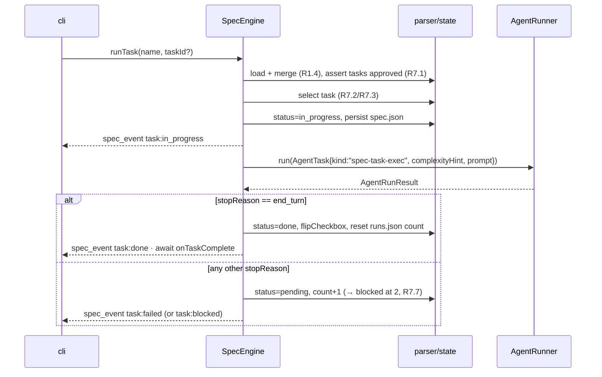

# Design — spec-engine workstream (`@cox/spec`)

Satisfies `docs/specs/spec-engine/requirements.md` (R-ids cited inline).
Contracts: `SpecEngine`, `SpecState`, `SpecTask`, `SpecPhase`,
`SpecPhaseStatus`, `SpecTaskStatus`, `AgentRunner`, `AgentTask`,
`AgentRunResult`, `AgentEvent`, `HookPayload` from `@cox/core`. No runtime
dependencies beyond `@cox/core` and node builtins (`node:fs/promises`,
`node:path`).

## Files

```
packages/spec/src/index.ts     re-exports createSpecEngine + SpecEngineDeps type
packages/spec/src/engine.ts    createSpecEngine — orchestration, gating, events
packages/spec/src/state.ts     spec.json + runs.json persistence, transitions, demotion cascade
packages/spec/src/parser.ts    tasks.md parse/render/flipCheckbox, requirements excerpt extraction
packages/spec/src/prompts.ts   SPEC_SYSTEM + REQUIREMENTS_PROMPT/DESIGN_PROMPT/TASKS_PROMPT/EXEC_PROMPT builders
packages/spec/test/engine.test.ts     lifecycle, gating, approvals, demotion (R1–R4)
packages/spec/test/generate.test.ts   generation paths incl. rejects (R5)
packages/spec/test/parser.test.ts     grammar, round-trip, surgical flip (R6)
packages/spec/test/runtask.test.ts    execution, failure→blocked, callbacks (R7)
packages/spec/test/tolerance.test.ts  hand-edit preservation, corruption (R8)
packages/spec/test/helpers.ts         FakeAgentRunner + mkdtemp scaffolding
packages/spec/NOTES.md                decisions/deviations for the integrator
```

## Factory (exact signature — the package's only public entry point)

```ts
export interface SpecEngineDeps {
  cwd: string;
  runner: AgentRunner;
  onEvent: (e: AgentEvent) => void;
  onPhaseChange?: (p: HookPayload) => Promise<void>;
  onTaskComplete?: (p: HookPayload) => Promise<void>;
  now: () => string; // ISO 8601; injected for deterministic tests
}

export function createSpecEngine(deps: SpecEngineDeps): SpecEngine;
```

Integration notes (for `@cox/cli`, recorded here so the lane is
self-contained):

- `sessionId` on every `AgentTask` the engine builds is `spec:<name>` —
  deterministic, groups a spec's calls in the ledger.
- The engine sets `AgentTask.system = SPEC_SYSTEM` (fixed bytes → prompt-
  cacheable). Project steering is injected by cli wrapping the `runner` dep
  with a decorator that prepends steering to `task.system`. The engine
  neither knows nor imports `@cox/steering`.
- Hook callbacks receive fully-formed `HookPayload`s; cli forwards them to
  `HookEngine.fire`. Payload shapes:
  `{event:"SpecPhaseChange", sessionId, cwd, data:{specName, phase, from, to}}`
  and `{event:"TaskComplete", sessionId, cwd, data:{specName, taskId, title}}`.

## Storage (R1)

```
<cwd>/.cox/specs/<name>/
  spec.json           serialized SpecState — STATUS truth (phases, approvals, task statuses)
  idea.md             the create() idea text (used by every later regen)
  requirements.md     CONTENT truth, human-editable
  design.md           CONTENT truth, human-editable
  tasks.md            CONTENT truth for the task set; checkboxes machine-owned
  tasks.rejected.md   last unparseable tasks generation (debug aid, R5.5)
  runs.json           { [taskId]: { consecutiveFailures: number; lastStopReason: string; lastRunAt: string } }
```

`runs.json` and `idea.md` are engine-private; they are not part of
`SpecState` and never surface through the interface. Writes go via
write-temp-then-rename (`spec.json.tmp` → `spec.json`) so a crash never
truncates state (R8.3 refuses to overwrite corrupt state; the `.tmp` dance
prevents creating it). `load` merge rule (R1.4): task *set* from
`tasks.md`, task *status* by id from `spec.json`, unknown ids → `pending`.

## State machine (R2–R4)

```
phases.<p>: "missing" → (generate) → "draft" → (approve) → "approved"
                                        ▲                       │
                                        └────── (generate) ─────┘  = regen, demotes (R4.1)
```

Transition guards live in `state.ts` as a pure function so tests hit them
directly:

```ts
export function assertCanGenerate(s: SpecState, phase: SpecPhase): void;
export function assertCanApprove(s: SpecState, phase: SpecPhase): void;
export function applyDemotionCascade(
  s: SpecState,
  regenerated: SpecPhase,
): { state: SpecState; demoted: SpecPhase[] };  // R4.2, pure
```

Downstream order is fixed: `requirements → design → tasks`. `"execution"`
is never a valid argument to `generate`/`approve` (R2.4). `approvals` is
append-only (R4.3); demotions only flip `phases` and emit events.

## Parser grammar (R6)

```
task-line      := "- [" ("x" | " ") "] " id ". " title
id             := /\d+(\.\d+)?/
metadata-line  := indent ("requirements: " r-id ("," ws r-id)*
                 | "complexity: " /[1-5]/
                 | key ": " rest)          ; unknown keys preserved, ignored
r-id           := /R\d+\.\d+/
indent         := two or more spaces
any other line := human-owned; preserved verbatim, never parsed (R6.2)
```

`parser.ts` exports:

```ts
export function parseTasks(md: string): { tasks: SpecTask[]; errors: string[] };
export function renderTasks(name: string, tasks: SpecTask[]): string; // heading + strict format
export function flipCheckbox(md: string, taskId: string): string;     // surgical, throws if line absent (R6.5)
export function extractRequirementExcerpts(reqMd: string, ids: string[]): string; // R7.4 — the "- R<id>: ..." lines (with continuation lines) for each id; missing ids noted inline
```

Validation (R6.3) runs on `parseTasks` output when called from `generate`
and `approve("tasks")`; `load` uses the tolerant path (errors ignored,
best-effort task set).

## Generation prompts (`prompts.ts`) — VERBATIM product surface

```ts
export const SPEC_SYSTEM = `You are Coxswain's spec author. You produce precise, testable
software specification documents. Follow the requested output format exactly: your final
message must contain ONLY the completed markdown document — no preamble, no commentary,
no code fences around the whole document. Be concrete and specific to THIS project; never
emit placeholder text like "TBD" or "as appropriate". British understatement over marketing
prose. Documents must be self-contained: a reader who has only your output can act on it.`;

export function requirementsPrompt(name: string, idea: string): string {
  return `Write the requirements document for a feature named "${name}".

The feature idea, verbatim from the user:
<idea>
${idea}
</idea>

Output format — follow it exactly:

# Requirements — ${name}

One short paragraph restating the idea as a goal (no marketing language).

Then 2–6 stories. Each story:

## Story <n>: <short title>
As a <role>, I want <capability>, so that <benefit>.

Acceptance criteria:
- R<n>.1: WHEN <trigger>, THE SYSTEM SHALL <observable response>.
- R<n>.2: IF <error or edge condition>, THEN THE SYSTEM SHALL <response>.
  (EARS keywords: WHEN, WHILE, WHERE, IF/THEN. Every criterion gets a stable
  id R<story>.<criterion> — these ids are referenced by design and tasks and
  must never be renumbered in later edits.)

Rules: every criterion independently checkable; no criterion may bundle two
behaviors ("and" is a smell); cover the unhappy paths (invalid input, missing
files, failures) — a spec with only happy paths is incomplete.`;
}

export function designPrompt(name: string, idea: string, requirementsMd: string): string {
  return `Write the technical design for feature "${name}". The requirements below are
approved and binding — the design must satisfy every R-id and reference them inline.

<requirements>
${requirementsMd}
</requirements>

You may read the repository with your tools first to ground the design in the real
codebase (existing patterns, file layout, naming). Prefer extending existing modules
over inventing new ones.

Output format — follow it exactly:

# Design — ${name}

## Overview
One paragraph: approach and why, plus rejected alternative in one sentence.

## Files
Table or list of every file to create or modify, with a one-line purpose each.

## Interfaces
The exact signatures/types/schemas to add or change, as code blocks. Cite the
R-ids each interface serves.

## Sequence
A mermaid sequenceDiagram of the main flow (and the key failure flow if it differs).

## Risks
2–5 bullets: what could go wrong technically, and the mitigation. Cite R-ids.

The original idea, for context only (requirements win on conflict):
<idea>${idea}</idea>`;
}

export function tasksPrompt(name: string, requirementsMd: string, designMd: string): string {
  return `Break the approved design for "${name}" into implementation tasks.

<requirements>
${requirementsMd}
</requirements>
<design>
${designMd}
</design>

Output format — follow it EXACTLY (it is machine-parsed; any deviation is rejected):

# Tasks — ${name}

- [ ] 1. <imperative task title>
  requirements: R1.1, R2.3
  complexity: 2

Rules:
- 5 to 15 tasks, ids sequential from 1 (sub-ids like 2.1 allowed).
- Every task lists the R-ids it satisfies; collectively the tasks must cover
  every R-id in the requirements (verify before answering).
- complexity is an integer 1–5: 1–2 mechanical (rename, boilerplate, config),
  3 routine implementation with tests, 4–5 cross-cutting or novel logic.
  Calibrate honestly — this drives which model executes the task.
- Order tasks so each depends only on earlier ones; task 1 is usually
  scaffolding, the last task is usually integration/verification.
- No prose outside the heading and the task list.`;
}

export function execPrompt(
  task: SpecTask, requirementExcerpts: string, designMd: string,
): string {
  return `Implement this task from the approved spec. It is one step of a larger plan —
do exactly this task: no more, no less.

Task ${task.id}: ${task.title}

It must satisfy these acceptance criteria:
<criteria>
${requirementExcerpts}
</criteria>

The approved design (binding — follow its file layout and interfaces):
<design>
${designMd}
</design>

Work to completion: implement, then verify (run the project's tests or the
narrowest relevant check). If verification fails, fix and re-verify before
finishing. Finish with a 2–4 sentence summary of what changed and how it was
verified. If the task cannot be completed as specified, say exactly what
blocks it instead of improvising around the design.`;
}
```

## Engine flow — `runTask` (R7)



`generate` follows the same shape with the phase templates; `maxTurns: 1`
for requirements/tasks, unset for design (R5.2); fence-strip then write
(R5.3); tasks output validated before write, rejects to
`tasks.rejected.md` (R5.5).

## Error handling

All thrown errors follow docs/04: actionable, name the operand
(`approve: phase "design" of spec "auth" is "missing" — generate it first`).
Events for non-throwing failures (generation rejects, corrupt spec.json in
`list`) per R1.6/R5.4/R5.5.

## Test plan & helpers

`test/helpers.ts`:

```ts
export function fakeRunner(script: Array<{
  finalText?: string;
  stopReason?: AgentRunResult["stopReason"]; // default "end_turn"
  events?: AgentEvent[];
}>): AgentRunner & { calls: AgentTask[] };   // records every AgentTask for assertions

export async function tmpProject(): Promise<{ cwd: string; cleanup: () => Promise<void> }>;
export const VALID_TASKS_MD: string;   // 3-task fixture in the exact grammar
export const REQ_FIXTURE_MD: string;   // requirements with R1.1–R2.2 for excerpt tests
```

Every test name cites its R-id (docs/04). The happy-path e2e
(`engine.test.ts`) walks the `safe-divide` scenario end to end with scripted
generations and asserts: file contents, spec.json statuses, emitted event
sequence, callback payloads, and `calls[i].kind/complexityHint/sessionId`.

## Risks

- **Model output drift breaks the tasks parser** (R5.5): mitigated by strict
  validation + `tasks.rejected.md` + the template's "EXACTLY" phrasing;
  regen is cheap.
- **Hand edits fight machine writes** (R8.1): mitigated by surgical
  `flipCheckbox` and re-parse-on-approve (R3.3); full-file rewrites happen
  only at generation time.
- **Crash mid-write corrupts state**: mitigated by temp-file+rename writes;
  R8.3 refuses to clobber corrupt `spec.json`.
- **Frozen `SpecState` has no failure-count field**: solved with
  engine-private `runs.json`; if the integrator later wants it surfaced,
  that's an INTEGRATION-NOTES.md contract proposal, not a local hack.
